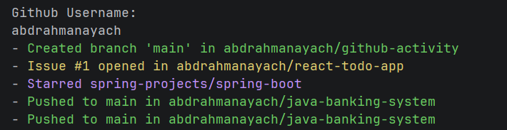

# GitHub Activity CLI

A simple command-line tool that fetches and displays the recent public activity of any GitHub user right in your terminal with color-coded output for each event type.

Built with Java 21 and the GitHub REST API.

## Demo



## Features

- Fetches the latest public events for any GitHub username via the official GitHub API.
- Human-readable, color-coded summaries powered by [Jansi](https://github.com/fusesource/jansi)
- Graceful error handling for unknown users and API failures.
- No authentication or token required for public activity.

## Supported events

| GitHub event        | Example output                                   |
| ------------------- | ------------------------------------------------ |
| `PushEvent`         | `Pushed to main in user/repo`                    |
| `IssuesEvent`       | `Issue #1 opened in user/repo`                   |
| `IssueCommentEvent` | `Commented on issue #1 in user/repo`             |
| `PullRequestEvent`  | `Pull request #4 opened in user/repo`            |
| `WatchEvent`        | `Starred user/repo`                              |
| `ForkEvent`         | `Forked user/repo to other-user/repo`            |
| `CreateEvent`       | `Created branch 'main' in user/repo`             |
| `DeleteEvent`       | `Deleted branch 'feature' in user/repo`          |

Any other event type falls back to a generic `<Type> in user/repo` line.

## Requirements

- **Java 21** or newer
- **Maven 3.6+**

## Getting started

Clone the repository and move into it:

```bash
git clone <your-repo-url>
cd github-activity
```

### Run with Maven

```bash
mvn compile exec:java
```

When prompted, enter a GitHub username:

```
Github Username:
torvalds
```
